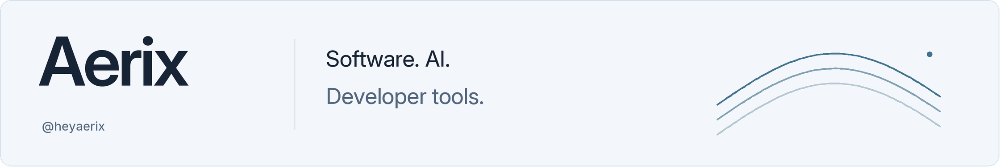

<picture>
  <source media="(prefers-color-scheme: dark)" srcset="./assets/profile-banner-dark.png">
  <source media="(prefers-color-scheme: light)" srcset="./assets/profile-banner-light.png">
  
</picture>

<em>
I build to understand. 
Every project starts with a question. I learn by turning that question into working software, testing it, and following the parts I don’t yet understand. 
I care about the details that become obvious when someone actually uses a tool: the confusing step, the broken state, the extra click. 
Novora is where I’m putting that approach into practice. Anyfacet is where I want future projects to grow. 
I want to make useful things—and become a better developer in the process.
</em>

---

## Now

**Founder of [Anyfacet](https://github.com/anyfacet)** — an independent software company building AI tools for developers. Novora is our first product.

**Creator of [Novora](https://novora.app)** — an AI coding workspace for turning ideas into working software. I’m building a desktop experience around projects, conversations, and AI agents. Currently in development.

## Working with

TypeScript · React · Electron · Node.js

---

[X · @aerixdev_](https://x.com/aerixdev_) · [Anyfacet](https://github.com/anyfacet)
